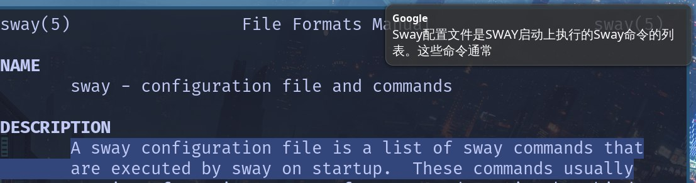

# translation-under-wayland

效果图如下:



思路:

1. 使用剪切板获取到选中文本的内容, 可以使用`wl-paste -p`来获取
2. 获取文本之后, 将换行符替换成空格 (这块可以有更好的处理方法, 简单起见就全换掉了), 使用`sed`
3. 文本处理完毕后, 将文本输入进`translate.js`中进行翻译, (这块可以使用别的现成工具)
4. 翻译结果出来之后, 将结果以系统通知的形式呈现出来, 当然, 系统通知必须要有, 可以是`dunst`, `mako`, `swaync`, 以及kde或者gnome的桌面消息通知都可以. 发送翻译结果使用命令`notify-send "标题" "翻译内容"`

以我的划词翻译为案例,  我在`~/.config/sway/config`中加入了这么一行作为划词翻译触发按键

```
bindsym Ctrl+Mod1+z exec ~/.config/sway/bin/translate.sh
```

那么来看看`translate.sh`的内容是怎么样的:

```bash
a=$(wl-paste -p | sed ':a;N;$!ba;s/\n/ /g' | node ~/.config/sway/bin/translate.js)
notify-send "Google" "$a"
```

首先从primary剪切板中获取选中的文本内容, 注意这个剪切板不需要你按ctrl-c, 选中文本的时候, 文本会自动出现在primary剪切板中. 然后使用`sed`命令将`\n`都替换为空格. 再然后执行js脚本, 将要翻译的内容通过管道符输入进去, js脚本调用谷歌翻译. 最后出来的翻译结果通过`notify-send`发送出去了. 

希望能够帮助到你~
